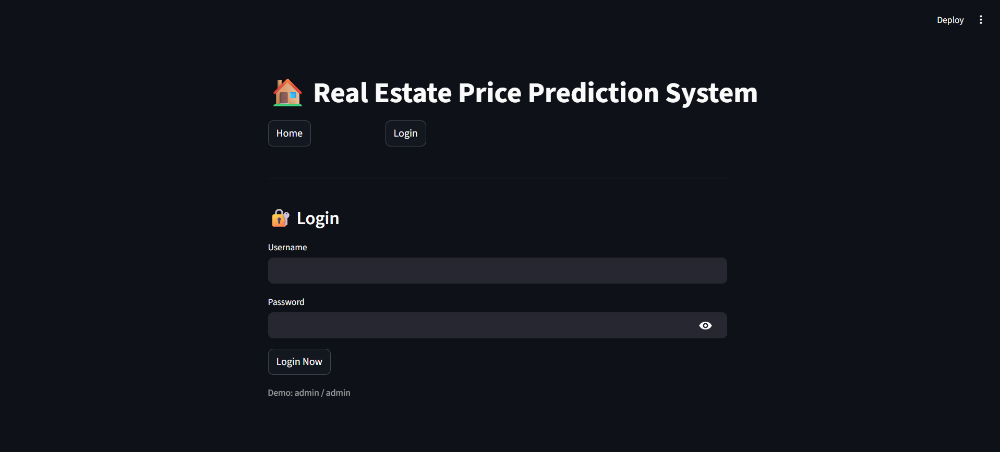

# 🏠 AI-Based Real Estate Price Prediction


> End-to-end ML system for house price prediction using FastAPI and Streamlit, trained on Chennai real estate data.

This project predicts house prices using Machine Learning models trained on Chennai real estate data. It implements a complete end-to-end pipeline from data preprocessing to model deployment using **FastAPI** and **Streamlit**.

---

## 🚀 Features

- Data preprocessing and cleaning pipeline
- Exploratory Data Analysis (EDA)
- Multiple ML models for comparison
- Best model selection using Gradient Boosting
- REST API built using FastAPI
- Interactive UI using Streamlit

---

## 📊 Model Performance

| Model                    | R² Score   |
| ------------------------ | ---------- |
| Linear Regression        | 0.9620     |
| Decision Tree            | 0.9483     |
| Random Forest            | 0.9763     |
| ✅ **Gradient Boosting** | **0.9825** |

> 🏆 The final model explains **98.25% of the variance in house prices**.

---

## 🔑 Key Features Used

| Feature          | Column       |
| ---------------- | ------------ |
| Interior Area    | `INT_SQFT`   |
| Number of Rooms  | `N_ROOM`     |
| House Age        | `HOUSE_AGE`  |
| Location         | `AREA`       |
| Building Type    | `BUILDTYPE`  |
| Parking Facility | `PARK_FACIL` |

---

## 📁 Project Structure

```
Real-Estate-Price-Prediction/
├── Models/
│   ├── gradient_boosting_model.pkl
│   └── feature_columns.txt
├── Script/
│   ├── data preprocessing scripts
│   └── model training scripts
├── api/
│   └── main.py
├── streamlit_app.py
├── requirements.txt
├── README.md
└── .gitignore
```

---

## 🏗️ System Architecture

```
User → Streamlit UI → FastAPI API → ML Model → Prediction
```

---

## ⚙️ Installation & Setup

### 1️⃣ Clone the repository

```bash
git clone https://github.com/<your-username>/<repo-name>.git
cd <repo-name>
```

### 2️⃣ Create virtual environment

```bash
python -m venv venv
venv\Scripts\activate
```

### 3️⃣ Install dependencies

```bash
pip install -r requirements.txt
```

---

## ▶️ Running the Application

### ✅ Step 1: Start FastAPI backend

```bash
uvicorn api.main:app --reload
```

> Server runs at: `http://127.0.0.1:8000`

### ✅ Step 2: Start Streamlit frontend

```bash
streamlit run streamlit_app.py
```

> App runs at: `http://localhost:8501`

---

## 📸 Application Screenshots

### Home Page


### Login Page


### Prediction Result


---

## 🧠 Key Insights

- Built-up area has the **strongest influence** on price
- Location **significantly impacts** property valuation
- Ensemble models **outperform** basic regression models
- Gradient Boosting provides the **best performance**

---

## 🔮 Future Improvements

- Implement advanced models like XGBoost
- Deploy to cloud platforms (AWS / Render)
- Add geospatial (map-based) interface
- Improve UI/UX design

---

## 👤 Author

**Mohnish Devaraj**

---

## 🙏 Acknowledgements

This project demonstrates an end-to-end Machine Learning pipeline including:

- Data preprocessing
- Feature engineering
- Model selection
- API development
- UI integration
